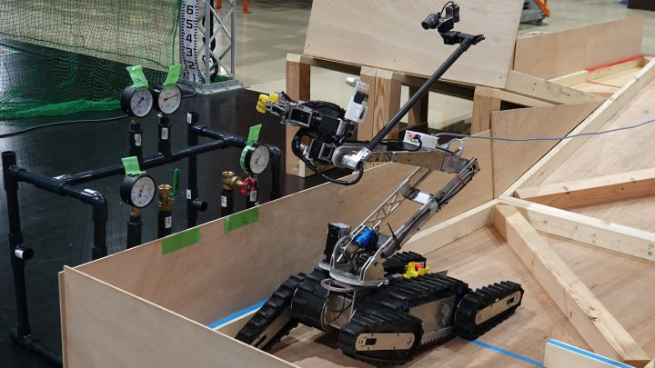

# R5SR
Nexis-Rの遠隔操縦型移動作業ロボット**R5S**のROS 2システム\


# 環境構築

## ネイティブ環境

- OS: Ubuntu 22.04
- ROS: ROS 2 Humble Hawksbill

### 開発ツールのインストール

- ビルドツールとコーディングツール
```bash
sudo apt install python3-colcon-mixin mold ccache ninja-build clang clangd clang-format cmake-format python3-pep8
```

- タスクランナ
```bash
wget -qO - 'https://proget.makedeb.org/debian-feeds/prebuilt-mpr.pub' | gpg --dearmor | sudo tee /usr/share/keyrings/prebuilt-mpr-archive-keyring.gpg 1> /dev/null
echo "deb [arch=all,$(dpkg --print-architecture) signed-by=/usr/share/keyrings/prebuilt-mpr-archive-keyring.gpg] https://proget.makedeb.org prebuilt-mpr $(lsb_release -cs)" | sudo tee /etc/apt/sources.list.d/prebuilt-mpr.list
sudo apt update
sudo apt install just
```

## コンテナ環境

- Docker
- VSCode Remote Container

## ワークスペースの設定

### r5srのクローン

```bash
git clone https://gitlab.com/nexis2/r5sr/r5sr.git
cd r5sr
```

コンテナ環境の場合は、VSCodeのRemote Containerを使用してコンテナを起動する。

### 依存関係のインストール

vcs import, rosdep install, その他の依存関係をインストールする。

#### ロボット

```bash
just setup robot
```

#### テレオペ

```bash
just setup teleop
```

## ビルド
```bash
just build
# or just b
```

# 起動方法

## ロボット
```bash
just bringup
# of just bu
```

## テレオペ
```bash
just teleop
# or just t
```

# Foxgloveの起動方法
操縦用UIはFoxgloveを採用しています。使い方に関しては[Foxgloveの使い方](docs/how_to_use_foxglove.md)