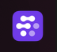
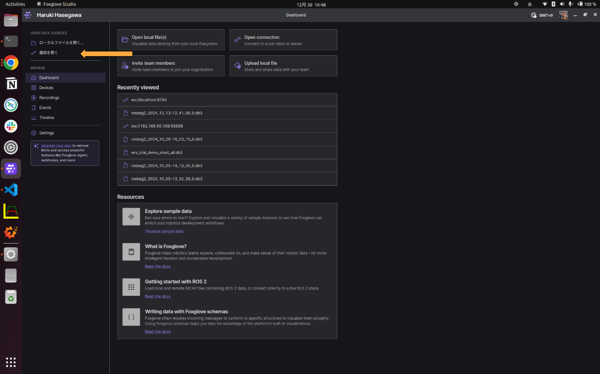
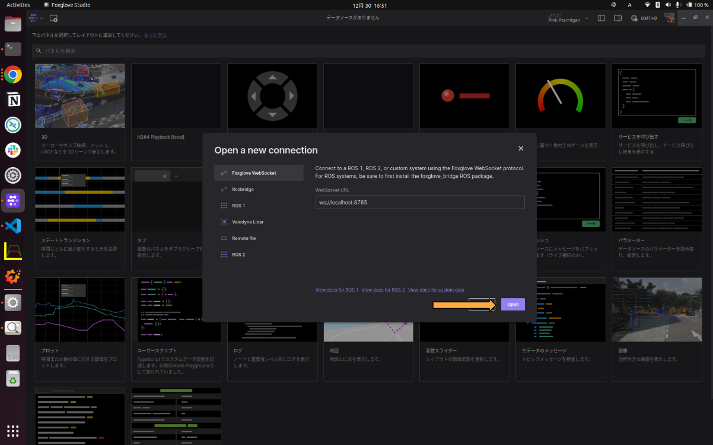
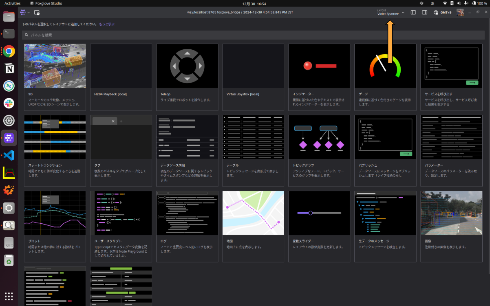
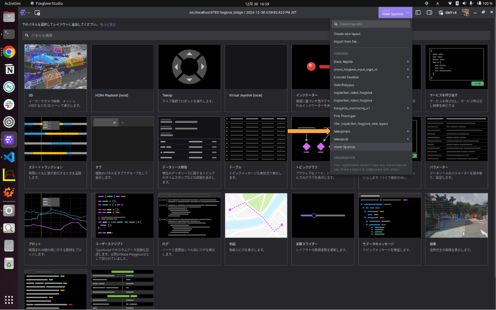
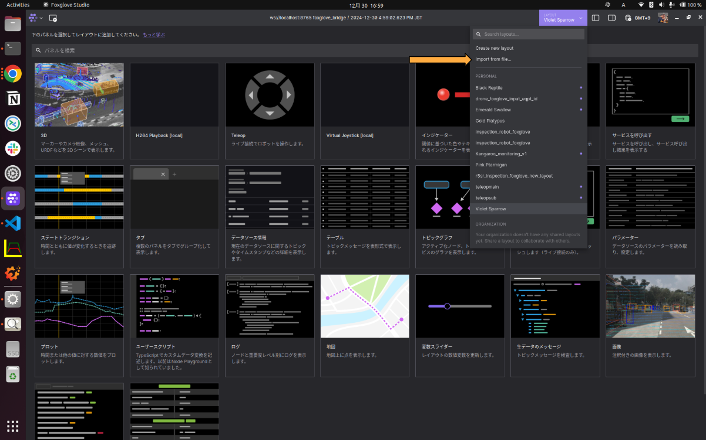
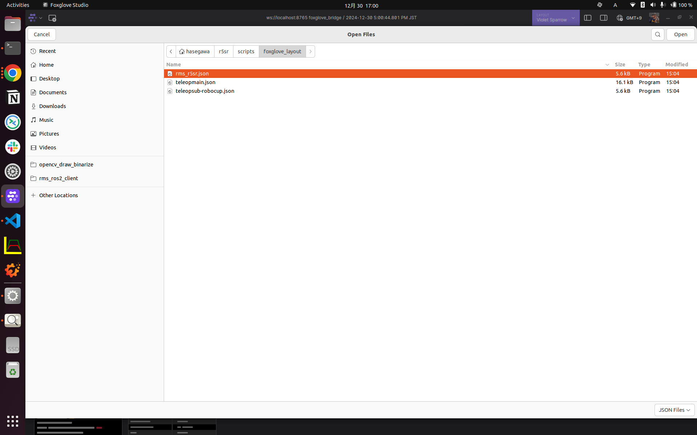
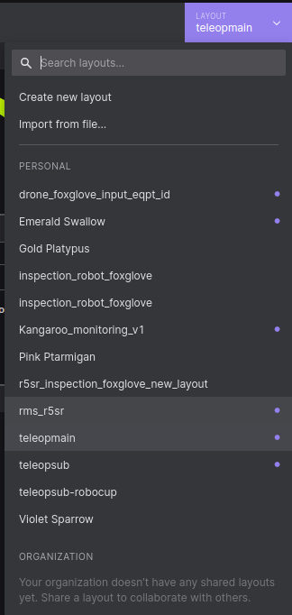
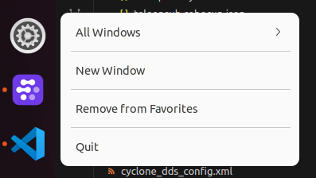

# foxglove操縦画面の開き方
#### 1. Foxglove Studioを開く


#### 2. 接続を開く


#### 3. Foxglove WebSocketを選択する。
WebSocket URLはデフォルトの```ws://localhost:8765```のままでOK。
その後```Open```を押すと接続される。


# foxgloveのレイアウト変更方法
#### 1. LAYOUTボタンを押す

#### 2. 任意のレイアウトを開く
r5srの場合は```teleopmain```・```teleopsub-robocup```・```rms_r5sr```が現在登録されています。


# foxgloveのレイアウト追加方法
#### 1. LAYOUTボタンを押す

#### 2. Import from fileを押す

#### 3. r5srのパッケージ内にあるレイアウトを追加する
```~/r5sr/scripts/foxglove_layout```にあるレイアウトを追加する。
最後に右上のOPENを押すと追加される。

#### 4. PERSONALの下にレイアウトが追加されているか確認する


# 画面の増やし方
左側のアイコンを右クリックして```New Window```を押す。これをすることによってFoxgloveの画面を増やすことができる。

